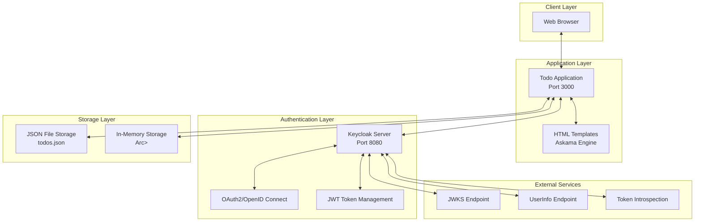
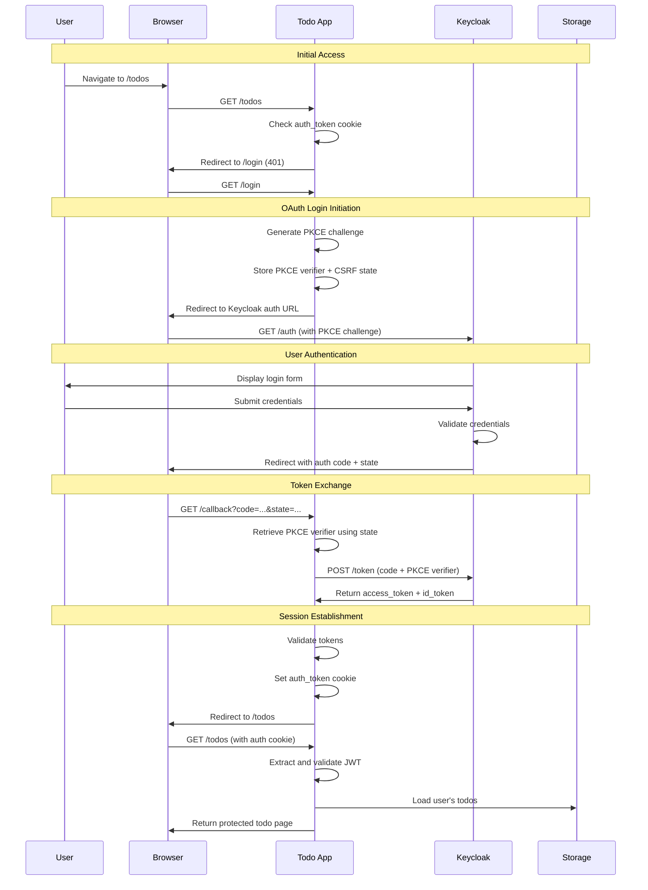
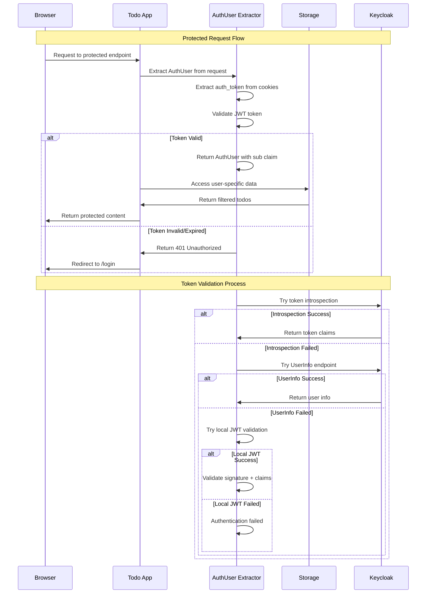
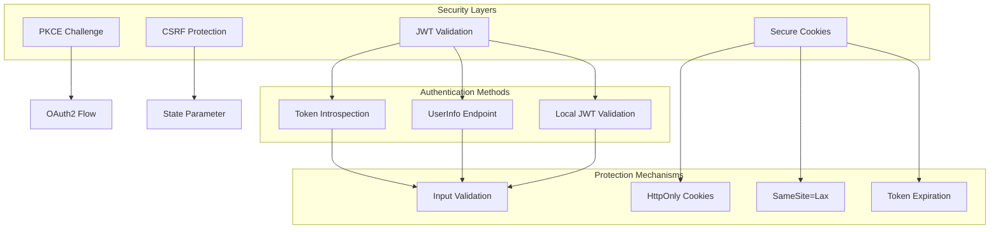
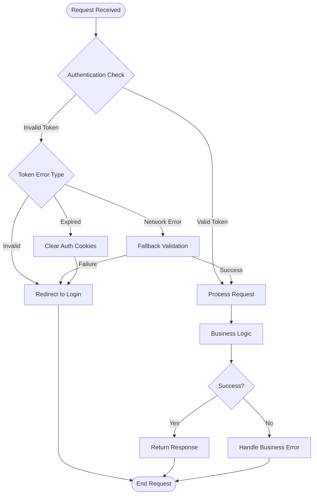
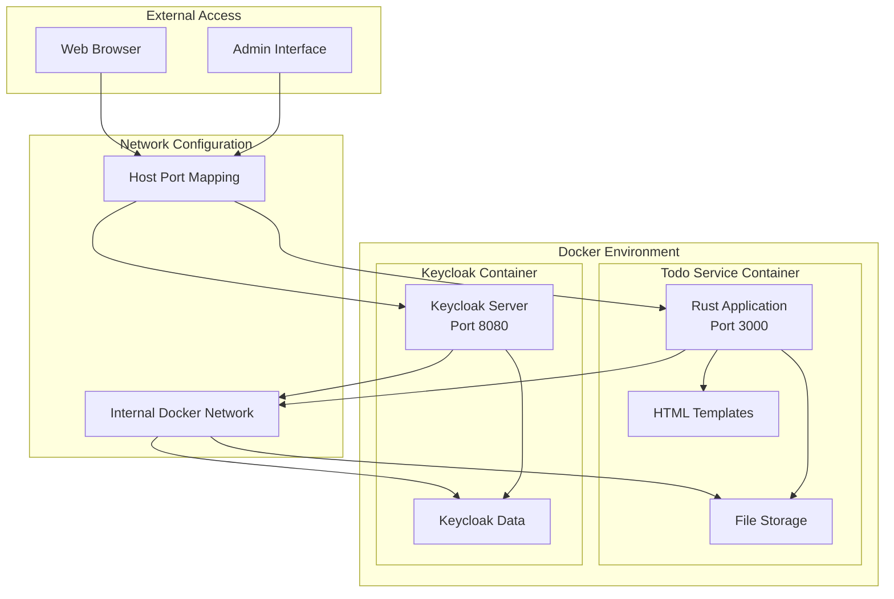

# Todo App System Architecture Diagram

This document contains Mermaid diagrams that illustrate the system architecture, authentication flow, and component interactions of the Todo application.

## System Overview

## Authentication Flow

## Request Flow for Protected Endpoints

## Security Architecture

## Error Handling Flow

## Deployment Architecture

These diagrams provide a comprehensive view of the Todo application's architecture, showing how different components interact, the authentication flow, security measures, and deployment structure. Each diagram focuses on a specific aspect of the system to make it easier to understand the complete picture.
